# Sparse Biomarker Discovery of tDCS Treatment Response in Adults with
Treatment-Resistant Depression using Low Montage Resting-State EEG

Abin Daniel Zorto${}^{1*}$, Jijomon C. Moncy${}^2$, Mhd Saeed Sharif${}^1$,
Cynthia H.Y. Fu${}^2$

${}^1$Intelligent Technologies Research Group, University of East London,
University Way, London E16 2RD, UK

${}^2$School of Psychology, University of East London, University Way,
London E16 2RD, UK

u2091940@uel.ac.uk, S.Sharif@uel.ac.uk, c.fu@uel.ac.uk

# Abstract

We evaluated whether a sparse, low-montage resting-state EEG pipeline could
identify clinically interpretable candidate biomarkers of response to
transcranial direct current stimulation (tDCS) in adults with treatment-resistant
depression under strict patient-level validation. The study used 4-channel
eyes-closed EEG and a controlled sweep of 150 successful runs across two model
families: an advanced hybrid 1D CNN-LSTM and a linear support vector machine
(SVM). The sweep varied window size (2–10 s) and the per-fold feature-selection
budget (inner-k 1–70), while holding the consensus feature budget fixed at 10
and enabling both leave-one-participant-out group equalization and SMOTE during
training.

The strongest configuration was the hybrid model with 6 s windows and inner-k=1.
That run reached patient-level ROC-AUC 0.816, PR-AUC 0.579, balanced accuracy
0.786, accuracy 0.810, and MCC 0.571 over 21 held-out participants. The best
SVM configuration (8 s, inner-k=30) reached ROC-AUC 0.510 and MCC 0.277. The
hybrid winner was also highly sparse, selecting 1 feature per fold and only 7
unique features overall, with a permutation-tested ROC-AUC advantage over chance
$(p = 0.008)$. Hard-set overlap across folds was modest (mean pairwise Jaccard
0.190; Kuncheva index 0.187). The recurrent features showed perfect mean
effect-direction consistency.

These results support a sparse short-timescale EEG framework that recovers a
small, interpretable candidate biomarker set while preserving useful
patient-level discrimination in a relatively small cohort. The most recurrent
features involved temporal spectral entropy and frontal-temporal asymmetry-derived
measures, and their class-conditional selection patterns motivate follow-up
validation in larger externally evaluated datasets.

# 1 Introduction

Treatment-resistant depression (TRD) remains a major clinical challenge, and
neuromodulation approaches such as transcranial direct current stimulation
(tDCS) continue to attract interest as potentially scalable adjunctive
interventions (Milev et al., 2016; Boggio et al., 2007; ?; ?; ?; Thair et al.,
2017; Cramer et al., 2011). More recent work has also pushed tDCS into remotely
supervised and home-based settings, which makes pretreatment stratification a
practical clinical problem (??). A useful biomarker pipeline has to identify
which patients are more or less likely to respond before stimulation begins.

In that setting, EEG is appealing because it is comparatively inexpensive,
portable, and already used across translational neurophysiology workflows.
Wearable and reduced-channel EEG systems further increase deployment feasibility,
although they also sharpen the trade-off between practicality and signal
richness (??BABILONI et al., 2012; ?; Simmatis et al., 2023; ?).

The literature on EEG biomarkers in major depressive disorder is encouraging and
methodologically uneven. Reviews and biomarker overviews have reported potentially
informative spectral, asymmetry, vigilance, entropy, and complexity signatures,
while also emphasizing cohort heterogeneity, protocol sensitivity, and the need
for clinically useful predictive markers (Olbrich and Arns, 2013; Olbrich et al.,
2015; Leuchter et al., 2010; ?; ?; Simmatis et al., 2023; ?; ?). Machine learning
studies have extended this theme into antidepressant, placebo, and neuromodulation
response prediction. External generalization, feature stability, and
interpretability remain active concerns (?Jaworska et al., 2019; Oakley et al.,
2022; Shalbaf et al., 2018; Ebrahimzadeh et al., 2021; ?; ?; ?; ?).

That tension is especially sharp in relatively small neuromodulation studies.
Rich models can improve representation learning, but relatively small cohorts
also increase the risk of unstable feature selection, inflated performance
estimates, and overly confident biomarker claims. Clinically deployable EEG
biomarkers also need interpretability and low-density feasibility. Emerging
response-prediction studies in depression and related neuromodulation settings
show substantial promise alongside clear methodological fragility (Funk and
George, 2008; Bailey et al., 2023; Murphy et al., 2023; Guo et al., 2024; Tsai
et al., 2023; ?; ?; ?; ?; Sheen et al., 2024; Zeidabadi and Rashidi, 2025;
Reissmann et al., 2026; Ulrich et al., 2025). Within the same home-based 4-channel
MDD program studied here, recent PSD-based and PLV-based analyses have already
shown that the baseline EEG carries treatment-response information across
multiple signal representations (??). That background makes this cohort a useful
setting for testing whether a sparse interpretable feature-selection workflow
can isolate a small recurrent biomarker set under strict participant-level
validation.

This manuscript focuses on a narrow objective: sparse biomarker discovery under
strict participant-level evaluation. We compare two classifiers over the same
feature-selection sweep to test whether a low-montage resting-state EEG pipeline
can recover a small recurring set of candidate markers associated with tDCS
response in adults with TRD. The emphasis is on parsimony, candidate-biomarker
interpretability, and leakage-resistant validation. Our working hypothesis was
that useful patient-level discrimination could be achieved with a small per-fold
feature budget and that the most recurrent features would show stronger
effect-direction consistency than hard-set overlap.

# 2 Methods

# 2.1 Dataset and signal representation

The analysis used pretreatment EEG from 21 adults with treatment-resistant
depression enrolled in a fully remote, multisite, double-blind, randomized
sham-controlled home-based tDCS trial for major depressive disorder (?). The
analyzed cohort contained 7 remission cases and 14 non-remission cases in the
patient-level outcome labels, with 18 female participants and a mean age of
$37.1 \pm 9.7$ years. Table 1 summarizes the cohort, acquisition, and sweep
configuration.

Table 1: Cohort, acquisition, and sweep configuration summary. Trial descriptors
derive from the parent home-based tDCS study (?); acquisition totals and sweep
settings derive from the analyzed EEG exports and current experiment
configuration.

|  |  |
| --- | --- |
| Characteristic | Value |
| Parent trial and cohort descriptors |
| Parent trial | Fully remote, multisite, sham-controlled home-based tDCS trial for MDD (?) |
| Participants | 21 |
| Outcome groups | 7 remission, 14 non-remission |
| Sex (female/male) | 18/3 |
| Age (years, mean ± SD) | 37.1 ± 9.7 |
| EEG acquisition and export descriptors |
| Rest condition | Eyes-closed resting state |
| EEG montage | 4 channels (AF7, AF8, TP9, TP10) |
| Channel coverage | Frontal (AF7, AF8), temporal (TP9, TP10) |
| Sampling rate | 256 Hz |
| Recording structure | 10 min total; single file or two 5 min files |
| Available export segment length | 10 s (2,560 samples/channel) |
| Total exported windows | 1,203 |
| Remission windows | 393 (32.7%) |
| Non-remission windows | 810 (67.3%) |
| Class ratio | 2.06:1 (non-remission:remission) |
| Current sweep methodology settings |
| Sweep window sizes | 2, 4, 6, 8, 10 s |
| Inner-k sweep | 1, 5, 10, 15, 20, 25, 30, 35, 40, 45, 50, 55, 60, 65, 70 |
| Outer-k | 10 |
| Feature selector | SelectKBest (f-classif) |
| Training adjustments | LOPO-group equalization + SMOTE |
| Validation | Leave-one-participant-out |
| Evaluation level | Patient-level aggregation |

Baseline recordings were collected during eyes-closed rest with a 4-channel
montage (AF7, AF8, TP9, TP10) sampled at 256 Hz. The available study exports
comprised 10 s segments with 2,560 samples per channel, and the underlying
recording sessions were stored either as a single 10 min file or as two 5 min
files depending on participant. Across the cohort, the export set contained
1,203 windows, including 393 remission-labeled and 810 non-remission-labeled
windows. This acquisition setup uses a limited frontal-temporal montage with
clear portable-deployment relevance (??). The montage also constrained the
downstream feature space toward frontal, temporal, cross-hemispheric, and
frontal-temporal interaction measures.

For the present sweep, the processing configuration applied participant-level
per-channel demeaning before upsampling, followed by a fourth-order Butterworth
low-pass filter at 60 Hz, a downsampling step back to 256 Hz, and zero-overlap
window slicing. The sweep then compared non-overlapping analysis windows of 2,
4, 6, 8, and 10 s, so the model inputs included both the native 10 s exports
and shorter subdivisions derived from the same recordings. These choices
materially affect downstream EEG feature distributions, especially in low-density
or portable pipelines (???BABILONI et al., 2012; Simmatis et al., 2023). The
feature extractor enabled spectral, temporal, entropy, complexity, connectivity,
coherence, asymmetry, and cross-hemispheric descriptors, including
frontal/temporal asymmetry, cross-regional ratios, and inter-channel coupling
measures.

This broad handcrafted feature pool was intended to preserve interpretability
while allowing sparse downstream selection.

# 2.2 Sweep design and validation

The experiment runner launched two model families over the same feature-selection
sweep: an advanced hybrid 1D CNN-LSTM and a linear SVM. All runs used sequential
window ordering, SelectKBest with ANOVA F statistics
(select\_k\_best\_f\_classif), a fixed consensus feature budget of outer-k=10,
leave-one-participant-out outer evaluation, leave-one-participant-out
training-group equalization, and SMOTE within training folds. The sweep varied
the per-fold feature-selection budget (inner-k) across 15 values from 1 to 70
and repeated the search across 5 window sizes, yielding 150 successful runs in
total (75 per model).

This design matters for interpretation. The outer evaluation remained subject
independent throughout, so no participant contributed both training and test
windows to the same outer fold. The inner-k parameter controlled how many
features were selected inside each outer training fold, whereas outer-k controlled
only the final consensus feature budget after cross-validation. The
feature-selection stability panels in the manuscript describe shared pipeline
behavior because both classifiers consumed the same selected features for matched
sweep settings.

# 2.3 Models

The SVM baseline used a linear kernel with class-balanced weighting and
probability output enabled. The hybrid model used a substantially richer
architecture defined in the project model configuration: stacked convolutional
blocks, bidirectional LSTM layers, multi-head attention with positional encoding,
feature-pyramid fusion, and GELU-activated dense layers with dropout and batch
normalization. The manuscript treats this architecture as a test case for whether
a more expressive learner can exploit a small selected feature set more
effectively than a linear baseline.

# 2.4 Outcome metrics and biomarker summaries

The primary endpoint was patient-level ROC-AUC, computed from participant
probabilities aggregated over held-out windows. Secondary patient-level metrics
included PR-AUC, balanced accuracy, accuracy, F1, MCC, precision, recall, and
specificity. The pipeline also reported bootstrap confidence intervals and a
permutation test for the patient-level ROC-AUC summary. All main manuscript
claims use patient-level metrics. Window-level scores appear only as intermediate
outputs.

To characterize biomarker behavior across outer folds, we used several post hoc
summaries: mean pairwise Jaccard overlap, Kuncheva index, unique feature count,
top-feature share, class-conditional selection deltas, and effect-direction
consistency. These summaries are descriptive. They characterize recurrence and
directionality across folds and do not support causal interpretation. Low overlap
can coexist with recurring features that retain consistent class-separation
direction when selected (Olbrich and Arns, 2013; Olbrich et al., 2015; Simmatis
et al., 2023).

# 3 Results

# 3.1 Sweep-level comparison

Across the 150 successful runs, the hybrid model outperformed the SVM baseline
on the main patient-level discrimination metrics over most of the sweep
landscape (Figure 1). The performance advantage was visible both when averaging
over window sizes and when averaging over inner-k settings. The best individual
hybrid run occurred at 6 s windows with inner-k=1, whereas the best SVM run
occurred at 8 s windows with inner-k=30.

The lower half of Figure 1 highlights a second, and more important, pattern.
Increasing inner-k increased both hard-set overlap and the total number of
unique selected features. Larger feature budgets did not produce the strongest
patient-level discrimination. The sweep concentrated its best performance at the
sparsest end of the per-fold selection range. This empirical pattern motivates
the paper's focus on sparse biomarker discovery.

Sweep Overview: Discrimination, Stability, and Parsimony

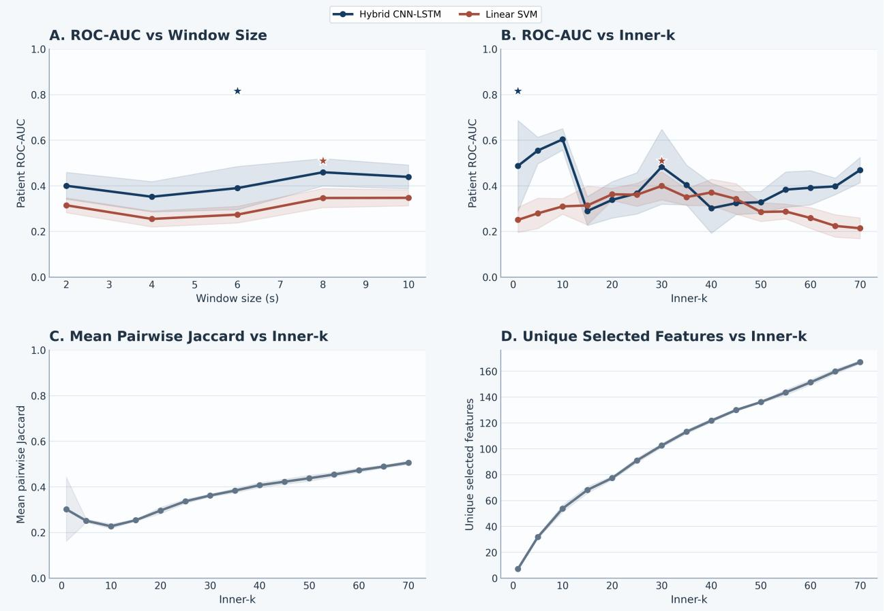

Hybrid CNN-LSTM → Linear SVM

Figure 1: Sweep-level overview across 150 successful runs. The top row compares
patient-level ROC-AUC by model as window size and inner-k vary. The bottom row
shows the shared feature-selection behavior of the pipeline because both
classifiers use the same selected feature subsets for matched sweep settings.
Stars mark the best individual hybrid and SVM runs.

# 3.2 Best-run patient-level performance

The best hybrid configuration achieved patient-level ROC-AUC 0.816, PR-AUC 0.579,
balanced accuracy 0.786, accuracy 0.810, F1 0.714, and MCC 0.571 over 21
held-out participants (Figure 2; Table 2). Its ROC-AUC bootstrap interval ranged
from 0.600 to 0.990, and the permutation test remained significant (p = 0.008),
which is notable given the relatively small cohort. The corresponding confusion
matrix contained 12 true negatives, 5 true positives, 2 false positives, and 2
false negatives.

The best SVM baseline reached balanced accuracy 0.643 and ROC-AUC 0.510, with a
nonsignificant permutation result (p = 0.469). This weaker performance came with
a much larger per-fold feature budget (inner-k=30) and a far larger overall
candidate set. The contrast indicates that the sparse hybrid pipeline extracted
stronger patient-level discrimination from a much smaller subset.

# Main Results

A Patient-Level Roc Curve

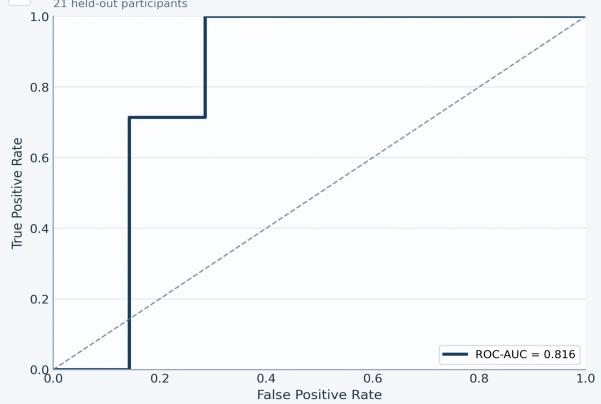

line

| False Positive Rate | True Positive Rate |
| ------------------- | ------------------ |
| 0.0 | 0.0 |
| 0.2 | 0.7 |
| 0.4 | 1.0 |
| 0.6 | 1.0 |
| 0.8 | 1.0 |
| 1.0 | 1.0 |

B Patient-Level Precision-Recall Curve

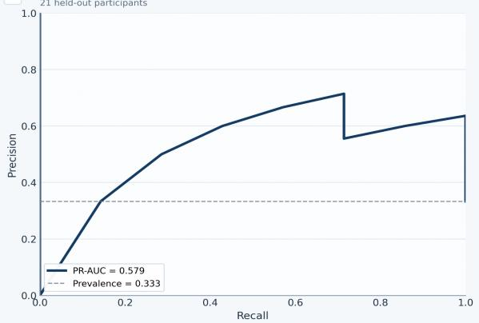

line

| Recall | Precision |
| ------ | --------- |
| 0.0 | 0.0 |
| 0.2 | 0.4 |
| 0.4 | 0.6 |
| 0.6 | 0.7 |
| 0.8 | 0.6 |
| 1.0 | 0.6 |

C Patient-Level Confusion Matrix

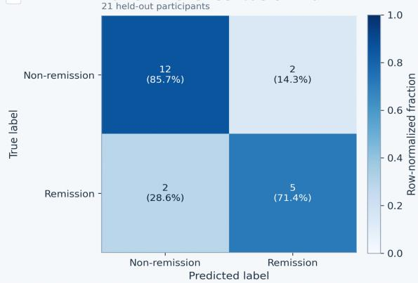

heatmap

21 held-out participants

| True label | Non-remission | Remission |
| :--- | :--- | :--- |
| Non-remission | 12 (85.7%) | 2 (14.3%) |
| Remission | 2 (28.6%) | 5 (71.4%) |

D Patient-Level Metric Summary

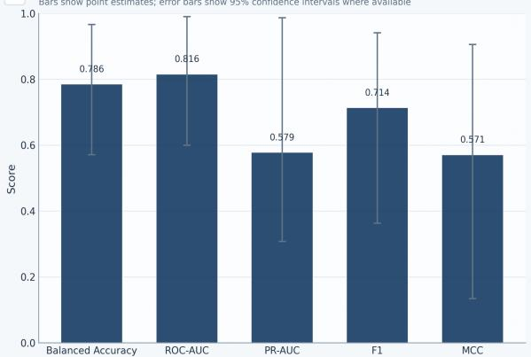

Figure 2: Best-run main-results composite for the hybrid model
(mlflow\_run\_id=561eb29a046946818320bea18f21bed6). The figure summarizes the
patient-level ROC curve, PR curve, confusion matrix, and metric summary for the
highest-performing sweep configuration.

Table 2: Best-performing configuration for each model family.

|  |  |  |  |  |  |  |  |  |  |  |
| --- | --- | --- | --- | --- | --- | --- | --- | --- | --- | --- |
| Model | Window | Inner-k | ROC-AUC | PR-AUC | Bal. Acc. | F1 | MCC | Feat./fold | Unique feat. | Mean Jaccard |
| Hybrid CNN-LSTM | 6 | 1 | 0.816 | 0.579 | 0.786 | 0.714 | 0.571 | 1.0 | 7 | 0.190 |
| Linear SVM | 8 | 30 | 0.510 | 0.411 | 0.643 | 0.533 | 0.277 | 30.0 | 103 | 0.360 |

# 3.3 Sparse biomarker set with modest hard-set overlap

The winning hybrid run selected an average of 1 feature per fold and yielded
only 7 unique recurrent features across the entire outer-validation process
(Table 3). That degree of sparsity is one of the most distinctive findings in
the sweep. Hard-set overlap was modest: mean pairwise Jaccard 0.190 and mean
Kuncheva index 0.187. Figure 3 summarizes the small recurrent pool together
with the modest chance-adjusted stability summary.

A small recurring feature set emerged repeatedly, though not in every fold, and
the selected set was dominated by temporal and frontal-temporal descriptors. The
most recurrent feature was tp10\_spectral\_entropy, selected in 8 of 21 folds.
The next most recurrent features were left\_frontal\_temporal\_diff\_gamma,
left\_frontal\_temporal\_diff\_beta, and af7\_zero\_crossings.

Biomarker Stability

Selection frequency of unique features

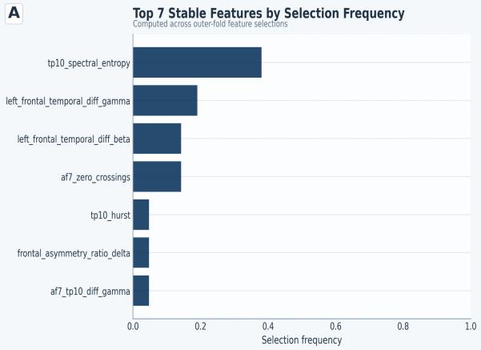

bar

| Feature | Selection frequency |
| --- | --- |
| tp10_spectral_entropy | 0.4 |
| left_frontal_temporal_diff_gamma | 0.2 |
| left_frontal_temporal_diff_beta | 0.15 |
| af7_zero_crossings | 0.15 |
| tp10_hurst | 0.05 |
| frontal_asymmetry_ratio_delta | 0.05 |
| af7_tp10_diff_gamma | 0.05 |

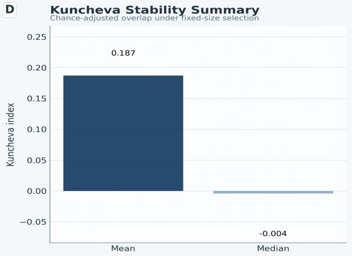

bar

| Statistic | Kuncheva index |
| --------- | -------------- |
| Mean | 0.187 |
| Median | -0.004 |

Figure 3: Biomarker-stability composite for the best hybrid run. Panel A ranks
the recurrent features by selection frequency. Panel D reports the modest
Kuncheva stability summary.

Table 3: Recurrent candidate biomarkers from the best hybrid run. Δ selection is
remission minus non-remission selection share.

|  |  |  |  |  |  |  |
| --- | --- | --- | --- | --- | --- | --- |
| Feature | Folds | Share | Δ sel. | Sign cons. | Mean d | Effect direction |
| tp10_spectral_entropy | 8 | 0.381 | -0.571 | 1.000 | -0.935 | Non-remission > remission |
| left_frontal_temporal_diff_gamma | 4 | 0.190 | -0.071 | 1.000 | -1.059 | Non-remission > remission |
| left_frontal_temporal_diff_beta | 3 | 0.143 | 0.000 | 1.000 | -0.915 | Non-remission > remission |
| af7_zero_crossings | 3 | 0.143 | 0.429 | 1.000 | 0.814 | Remission > non-remission |
| tp10_hurst | 1 | 0.048 | 0.143 | 1.000 | -1.010 | Non-remission > remission |
| af7_tp10_diff_gamma | 1 | 0.048 | 0.143 | 1.000 | -1.203 | Non-remission > remission |
| frontal_asymmetry_ratio_delta | 1 | 0.048 | -0.071 | 1.000 | 0.794 | Remission > non-remission |

# 3.4 Effect-direction consistency and class-conditional patterns

The recurrent hybrid biomarkers showed perfect mean sign consistency across the
effect-stability summary. This supports treating them as candidate biomarkers
with stable directionality across the folds in which they were selected.
tp10\_spectral\_entropy and the frontal-temporal gamma and beta difference terms
were repeatedly associated with the non-remission group, whereas af7\_zero\_crossings
was more frequently selected in remission folds and retained a positive mean
effect size (Figure 4).

This distinction matters clinically. The selection-frequency deltas do not
justify definitive mechanistic claims. They provide a concrete interpretation
target for follow-up validation. The best hybrid pipeline contributes two linked
observations: useful patient-level discrimination can be achieved with an
extremely sparse feature budget, and the resulting recurrent candidates show
interpretable directionality even when fold-to-fold set overlap remains modest.

# Biomarker Interpretation

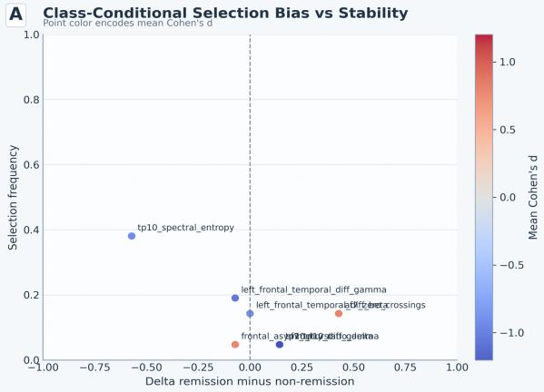

scatter

| Point | Delta remission minus non-remission | Selection frequency |
|-------|-------------------------------------|---------------------|
| tp10_spectral_entropy | -0.5 | 0.4 |
| left_frontal_temporal_diff_gamma | -0.1 | 0.2 |
| left_frontal_temporal_diff_crossings | 0.3 | 0.15 |
| p10_spectral_diffog_delta | 0.2 | 0.05 |
| p10_spectral_diffog_delta | 0.1 | 0.03 |

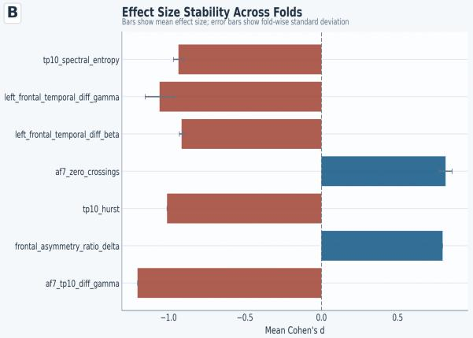

bar

| Fold | Effect Size (Mean Cohen's d) |
| --- | --- |
| tp10_spectral_entropy | -0.9 |
| left_frontal_temporal_diff_gamma | -1.1 |
| left_frontal_temporal_diff_beta | -0.8 |
| af7_zero_crossings | 0.8 |
| tp10_hurst | -0.9 |
| frontal_asymmetry_ratio_delta | 0.8 |
| af7_tp10_diff_gamma | -1.2 |

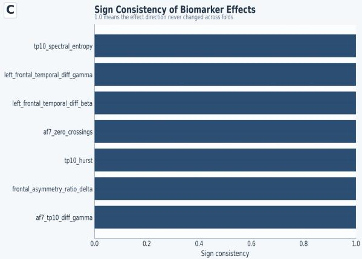

bar

| Biomarker Effect | Sign Consistency |
| --------------------------------- | ---------------- |
| tp10_spectral_entropy | 1.0 |
| left_frontal_temporal_diff_gamma | 1.0 |
| left_frontal_temporal_diff_beta | 1.0 |
| af7_zero_crossings | 1.0 |
| tp10_hurst | 1.0 |
| frontal_asymmetry_ratio_delta | 1.0 |
| af7_tp10_diff_gamma | 1.0 |

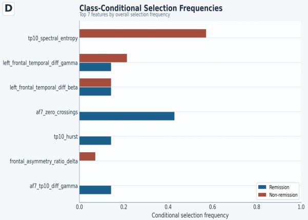

bar

Class-Conditional Selection Frequencies

| Feature | Remission | Non-remission |
| :--- | :--- | :--- |
| tp10_spectral_entropy | 0.0 | 0.56 |
| left_frontal_temporal_diff_gamma | 0.14 | 0.21 |
| left_frontal_temporal_diff_beta | 0.14 | 0.14 |
| af7_zero_crossings | 0.43 | 0.0 |
| tp10_hurst | 0.14 | 0.0 |
| frontal_asymmetry_ratio_delta | 0.0 | 0.08 |
| af7_tp10_diff_gamma | 0.14 | 0.0 |

Figure 4: Biomarker-interpretation composite for the best hybrid run. The
recurring features show consistent effect direction, with tp10\_spectral\_entropy
skewing toward non-remission-associated selections and af7\_zero\_crossings
skewing toward remission-associated selections.

# 4 Discussion

The strongest patient-level discrimination in this sweep emerged from the
sparsest tested configuration. The best hybrid run used inner-k=1, selected only
7 unique recurrent features overall, and exceeded the best linear baseline by a
large margin on ROC-AUC and MCC. In this cohort, performance depended on how
effectively the model used a small selected subset.

This result fits part of the EEG depression literature and warrants conservative
interpretation. Prior work has argued that EEG can provide clinically useful
baseline markers in major depressive disorder and treatment-response settings,
and it has also emphasized the need for tighter biomarker discipline, better
standardization, and more realistic expectations about generalization (Olbrich
and Arns, 2013; Olbrich et al., 2015; Leuchter et al., 2010; Simmatis et al.,
2023; Alonso et al., 2017; ?). Machine learning studies have likewise reported
encouraging treatment-response signals, including combinations of EEG and
clinical covariates, yet translation is often limited by data heterogeneity,
cohort size, or insufficient interpretability (?Jaworska et al., 2019; Oakley
et al., 2022; Shalbaf et al., 2018; Ebrahimzadeh et al., 2021; ?; ?; ?).

The present sweep adds a feature-selection view to that literature. The shared
feature-selection panels in Figure 1 show that larger feature budgets yield more
overlap and many more unique discovered features. Those larger budgets do not
improve discrimination. The panels support a small recurring candidate set with
consistent direction of class separation. That reading keeps the modest Jaccard
and Kuncheva scores in view and gives appropriate weight to the stronger
effect-direction signal.

The same clinical program has also supported other signal representations in
recent colleague papers. PSD-based deep learning on the baseline 4-channel MDD
recordings identified informative low-density temporal signal content, and
PLV-based analyses from the same home-based trial linked frontal-temporal and
temporoparietal synchronization to treatment response (??). In the present sweep,
the recurrent candidate set again concentrated in TP10-derived and
frontal-temporal descriptors. That regional convergence supports the view that
the low-montage recordings contain response-relevant information across multiple
feature families.

The specific candidates in the present sweep are plausible enough to deserve
follow-up. tp10\_spectral\_entropy was the most frequently selected feature and
skewed toward non-remission-associated folds, whereas af7\_zero\_crossings skewed
toward remission-associated folds. The recurrent set emphasized temporal and
frontal-temporal descriptors, with limited concentration in any single frontal
asymmetry family. This regional profile is compatible with the same-program PSD
and PLV findings, which also concentrated informative signal in TP10-centered or
frontal-temporal relationships (??). The current study contributes a sparse
handcrafted candidate set with explicit recurrence and effect-direction summaries.

Related home-based tDCS studies in bipolar depression from the same group point
in a similar low-montage direction. PSD-based modeling again highlighted AF7 and
TP10 signal content, and PLV analyses emphasized frontal-temporal and
temporoparietal synchronization patterns (??). These bipolar studies address a
different diagnosis and treatment protocol. They support reduced-montage
feasibility and signal plausibility in adjacent affective cohorts.

The dataset is relatively small (n = 21), the confidence intervals are wide, and
there is no external validation set. The bottom-row sweep panels describe the
selection pipeline itself because the same feature-selection layer feeds both
classifiers. Class-conditional ratios also become unstable when a feature is
absent from one class, so the manuscript uses deltas and effect direction as the
main descriptive summaries. The recurring features are best treated as candidate
biomarkers for follow-up validation.

Future work should test whether the same sparse feature set recurs under
independent cohorts, alternative low-density montages, and explicit external
validation (?). Adjacent response-prediction work in depression and neuromodulation
provides useful targets for that next stage, including EEG-based prediction of
antidepressant response, treatment-resistant depression biomarkers, and
neuromodulation-specific response signatures (Funk and George, 2008; Bailey et
al., 2023; Guo et al., 2024; ?; ?; ?; Romero-Marín et al., 2026; Kratter et al.,
2026; Waller et al., 2026; Sheen et al., 2024; Zeidabadi and Rashidi, 2025;
Reissmann et al., 2026; Ulrich et al., 2025; Pettorruso et al., 2024). These
extensions should keep stringent patient-level evaluation and sparse interpretable
feature budgets in the core study design.

# 5 Conclusion

In this sweep, low-montage resting-state EEG supported useful patient-level
discrimination of tDCS response in adults with treatment-resistant depression,
and the strongest result came from an extremely sparse feature-selection regime.
The best hybrid run achieved ROC-AUC 0.816 while selecting only 1 feature per
fold and 7 unique recurrent features overall. Hard-set overlap across folds
remained modest. The present evidence supports a small, interpretable candidate
set with consistent effect direction under strict participant-level validation.

That combination of parsimony, interpretability, and subject-independent
evaluation defines the main contribution of the present draft. External
validation in larger cohorts is the next requirement. The current results support
the feasibility of sparse short-timescale EEG biomarker discovery for tDCS
response in a clinically realistic low-density setting.

# References

Abbott, Christopher C, Calhoun, Vince D, Espinoza, Randall, Jiang, Rongtao, Jones,
Tom, Narr, Katherine L, Qi, Shile, Sui, Jing, Sun, Hailun, Upston, Joel, Wade,
and Benjamin Sc. Preliminary prediction of individual response to electroconvulsive
therapy using whole-brain functional magnetic resonance imaging data. 2020. doi:
10.1016/j.nicl.2019.102080. URL https://escholarship.org/uc/item/12x366xr.

Abelson, J, Akeman, E, Aupperle, Robin L, Bodurka, J, Clausen, AN, Cosgrove, KT,
Craske, MG, Kirlic, N, Martell, C, Mathis, B, McDermott, TJ, Paulus, M, Santiago,
J, Thompson, WK, Wolitzky-Taylor, and K. Protocol for a randomized controlled
trial examining multilevel prediction of response to behavioral activation and
exposure-based therapy for generalized anxiety disorder. 2020. doi:
10.21203/rs.2.13364/v2. URL https://escholarship.org/uc/item/6cb012mk.

Agnetti, Virgilio, Aiello, Elena, De Natale, Edoardo, Deriu, Franca, Paulus, Kai
Stephan, Sotgiu, Giovanni, Tolu, and Eusebio. Effects of dance therapy on balance,
gait and neuro-psychological performances in patients with parkinson's disease and
postural instability, 2012. URL https://core.ac.uk/download/16749566.pdf.

Golnoush Alamian, Ana-Sofía Hincapié, Etienne Combrisson, Thomas Thiery, Véronique
Martel, Dmitrii Althukov, and Karim Jerbi. Alterations of intrinsic brain
connectivity patterns in depression and bipolar disorders: A critical assessment
of magnetoencephalography-based evidence. Frontiers in Psychiatry, 2017. doi:
10.3389/fpsyt.2017.00041. URL https://doi.org/10.3389/fpsyt.2017.00041.

Lindsay Alexander, Jasmine Escalera, Lei Ai, Charissa Andreotti, Karina Febre,
Alexander Mangone, Natan Vega Potler, Nicolas Langer, Alexis Alexander, Meagan
Kovacs, Shannon Litke, Bridget O'Hagan, J. E. Andersen, Batya Bronstein, Anastasia
Bui, Marijayne Bushey, H. W. Butler, Victoria Castagna, Nicolas L. Camacho, Elisha
Chan, Danielle Citera, Jon Clucas, Samantha Cohen, Sarah Dufek, Megan Eaves, Brian
Fradera, Judith Gardner, Natalie Grant-Villegas, Gabriella Green, C. Jane Gregory,
Emily Hart, Shana Harris, Megan K. Horton, Danielle Kahn, Katherine E.
Kabotyanski, Bernard Z. Karmel, Simon P. Kelly, Kayla Kleinman, Bonhwang Koo,
Eliza Kramer, Elizabeth M. Lennon, Catherine Lord, Ginny Mantello, Amy Margolis,
Kathleen R. Merikangas, Judith Milham, Giuseppe Minniti, Rebecca Neuhaus,
Alexandra M. Levine, Yael Osman, Lucas C. Parra, Ken Pugh, Amy Racanello, Anita
Restrepo, Tian Saltzman, Batya Septimus, Russell H. Tobe, Rachel Waltz, Anna
Williams, Anna J. Yeo, F. Xavier Castellanos, Arno Klein, Tomáš Paus, Bennett L.
Leventhal, R. Cameron Craddock, Harold S. Koplewicz, and Michael P. Milham. An
open resource for transdiagnostic research in pediatric mental health and learning
disorders. Scientific Data, 2017. doi: 10.1038/sdata.2017.181. URL
https://doi.org/10.1038/sdata.2017.181.

Elena A. Allen, Eswar Damaraju, Sergey Plis, Erik B. Erhardt, Tom Eichele, and
Vince D. Calhoun. Tracking whole-brain connectivity dynamics in the resting state.
Cerebral Cortex, 2012. doi: 10.1093/cercor/bhs352. URL
https://doi.org/10.1093/cercor/bhs352.

Alonso, Esther, Arnott, Stephen R., Atluri, Sravya, Blumberger, Daniel, Brenner,
Colleen A., Daskalakis, Zafiris J., Dhami, Prabhjot, Dharsee, Moyez, Evans,
Kenneth R., Farzan, Faranak, Frehlich, Matthew, Frey, Benicio N., Kennedy, Sidney
H., Kleffner, Killian, Lam, Raymond W., Liotti, Mario, Mcandrews, Mary Pat, Milev,
Roumen, Price, Rae, Ravindran, Arun, Rotzinger, Susan, Vila-Rodriguez, Fidel,
Wong, and Willy. Standardization of electroencephalography for multi-site,
multi-platform and multi-investigator studies: Insights from the canadian biomarker
integration network in depression. Scientific Reports, 2017. doi:
10.1038/s41598-017-07613-x. URL
https://www.research.unipd.it/bitstream/11577/3260320/1/Liotti_SciRep2017.pdf.

BABILONI, CLAUDIO, Boeijinga PH, Brunovsky M, Drinkenburg WH, Ffytche DH, Freeman
J, Hegerl U, Hirata K, IPEG Pharmaco EEG Guidelines
C.o.m.m.i.t.t.e.e. Collaborators, Jobert M, Kinoshita T, Knott VJ, Lopes Da Silva
FH, Matousek M, Mucci A, Nottage JF, Olbrich S, Prichep LS, Ruigt GS, Saletu B,
Stancak A, Strik WK, van Gerven JM, Wilson FJ, and Wise RG. Guidelines for the
recording and evaluation of pharmaco-eeg data in man: the international
pharmaco-eeg society (ipeg). 2012. doi: 10.1159/000343478. URL
https://iris.uniroma1.it/bitstream/11573/802874/1/Jobert_Guidelines_2012.pdf.

Ganesh M. Babulal, Yakeel T. Quiroz, Benedict C. Albensi, Eider M.
Arenaza-Urquijo, Arlene Astell, Claudio Babiloni, Alex Bahar-Fuchs, J. Simon
Bell, Gene L. Bowman, Adam M. Brickman, Gaël Chételat, Carrie Ciro, Ann D. Cohen,
Peggye Dilworth-Anderson, Hiroko H. Dodge, Simone Dreux, Steven D. Edland, Anna
J. Esbensen, Lisbeth Evered, Michael Ewers, Keith N. Fargo, Juan Fortea, Hector
M. González, Deborah Gustafson, Elizabeth Head, James A. Hendrix, Scott M. Hofer,
Leigh Johnson, Roos J. Jutten, Kerry Kilborn, Krista L. Lanctôt, Jennifer J.
Manly, Ralph N. Martins, Michelle M. Mielke, Martha Clare Morris, Melissa E.
Murray, Esther S. Oh, Mario A. Parra, Robert A. Rissman, Catherine M. Roe, Octavio
A. Santos, Nikolaos Scarmeas, Lon S. Schneider, Nicole Schupf, Sietske A.M. Sikkes,
Heather M. Snyder, Hamid R. Sohrabi, Yaakov Stern, André Strydom, Yi Tang, Graciela
Muñiz-Terrera, Charlotte E. Teunissen, Debora Melo van Lent, Michael Weinborn,
Linda M.P. Wesselman, Donna M. Wilcock, Henrik Zetterberg, and Sid E. O'Bryant.
Perspectives on ethnic and racial disparities in alzheimer's disease and related
dementias: Update and areas of immediate need. Alzheimer's & Dementia, 2018. doi:
10.1016/j.jalz.2018.09.009. URL https://doi.org/10.1016/j.jalz.2018.09.009.

N. Bailey, K. Hoy, C. Sullivan, B. Allman, N. Rogasch, Z. Daskalakis, and P.
Fitzgerald. Concurrent transcranial magnetic stimulation and electroencephalography
measures are associated with antidepressant response from rtms treatment for
depression. medRxiv, 2023. doi: 10.1101/2023.02.10.23285794. URL
https://www.semanticscholar.org/paper/8278c0b8d2b48ae5ed473c09d6c3f9ba34f53391.

Paulo S. Boggio, Sergio P. Rigonatti, Rafael Bernardon Ribeiro, Martin Luiz
Myczkowski, Michael A. Nitsche, Álvaro Pascual-Leone, and Felipe Fregni. A
randomized, double-blind clinical trial on the efficacy of cortical direct current
stimulation for the treatment of major depression. The International Journal of
Neuropsychopharmacology, 2007. doi: 10.1017/s1461145707007833. URL
https://doi.org/10.1017/s1461145707007833.

Alexander A. Borbély, Serge Daan, Anna Wirz-Justice, and Tom Deboer. The
two-process model of sleep regulation: a reappraisal. Journal of Sleep Research,
2016. doi: 10.1111/jsr.12371. URL https://doi.org/10.1111/jsr.12371.

Cecchi, Nicholas J, Gerges, Paul, Hicks, James W, Monroe, Derek C, Phreaner,
Jenna, Small, and Steven L. A dose relationship between brain functional
connectivity and cumulative head impact exposure in collegiate water polo players.
2020. doi: 10.3389/fneur.2020.00218. URL
https://escholarship.org/content/qt3dk7m0zg/qt3dk7m0zg.pdf?t=qafdxa.

Wei-Liang Chen, Julie C. Wagner, Nicholas Heugel, Jeffrey Sugar, Yu-Wen Lee, Lisa
L. Conant, Marsha Malloy, Joseph Heffernan, Brendan J. Quirk, Anthony Zinos, Scott
A. Beardsley, Robert W. Prost, and Harry T. Whelan. Functional near-infrared
spectroscopy and its clinical application in the field of neuroscience: Advances
and future directions. Frontiers in Neuroscience, 2020. doi:
10.3389/fnins.2020.00724. URL https://doi.org/10.3389/fnins.2020.00724.

Steven C. Cramer, Mriganka Sur, Bruce H. Dobkin, Charles P. O'Brien, Terence D.
Sanger, John Q. Trojanowski, Judith M. Rumsey, Ramona Hicks, Judy L. Cameron,
David Chen, Wen Chen, Leonardo G. Cohen, C. deCharms, C. J. Duffy, Guinevere F.
Eden, E. E. Fetz, Rosemarie Filart, M C Freund, Steven Grant, Suzanne N. Haber,
Peter W. Kalivas, Bryan Kolb, Arthur F. Kramer, Michael P. Lynch, Helen S. Mayberg,
Patrick S. McQuillen, Ralph Nitkin, A. Pascual–Leone, Patricia A. Reuter-Lorenz,
Nicholas D. Schiff, Anu Sharma, L. Shekim, Michael P. Stryker, Edith V. Sullivan,
and Sophia Vinogradov. Harnessing neuroplasticity for clinical applications.
Brain, 2011. doi: 10.1093/brain/awr039. URL
https://doi.org/10.1093/brain/awr039.

Karen D. Davis, Nima Aghaeepour, Andrew H. Ahn, Martin S. Angst, David Borsook,
Ashley Brenton, Michael E. Burczynski, Christopher Crean, Robert R. Edwards, Brice
Gaudillière, Georgene W. Hergenroeder, Michael J. Iadarola, Smriti Iyengar,
Yunyun Jiang, Jiang-Ti Kong, Sean Mackey, Carl Y. Saab, Christine N. Sang,
Joachim Scholz, Märta Segerdahl, Irene Tracey, Christin Veasley, Jing Wang, Tor D.
Wager, Ajay D. Wasan, and Mary Ann Pelleymounter. Discovery and validation of
biomarkers to aid the development of safe and effective pain therapeutics:
challenges and opportunities. Nature Reviews Neurology, 2020. doi:
10.1038/s41582-020-0362-2. URL https://doi.org/10.1038/s41582-020-0362-2.

Hanneke van Dijk, Guido van Wingen, Damiaan Denys, Sebastian Olbrich, Rosalinde
van Ruth, and Martijn Arns. The two decades brainclinics research archive for
insights in neurophysiology (tdbrain) database. Scientific Data, 2022. doi:
10.1038/s41597-022-01409-z. URL https://doi.org/10.1038/s41597-022-01409-z.

Duncan, John S, Elger, Christian E, Engel, Jerome, Staba, Richard, Vakharia,
Vejay N, Witt, and Juri-Alexander. Getting the best outcomes from epilepsy
surgery., 2018. URL https://escholarship.org/content/qt0120f648/qt0120f648.pdf?t=qaehok.

Wallace C. Duncan, Simone Sarasso, Fabio Ferrarelli, Jessica Selter, Brady A.
Riedner, Nadia S. Hejazi, Peixiong Yuan, Nancy E. Brutsché, Husseini K. Manji,
Giulio Tononi, and Carlos A. Zarate. Concomitant bdnf and sleep slow wave changes
indicate ketamine-induced plasticity in major depressive disorder. The
International Journal of Neuropsychopharmacology, 2012. doi:
10.1017/s1461145712000545. URL
https://doi.org/10.1017/s1461145712000545.

Elias Ebrahimzadeh, Mostafa Asgarinejad, Sarah Saliminia, Sarvenaz Ashoori, and
Masoud Seraji. Predicting clinical response to transcranial magnetic stimulation
in major depression using time-frequency eeg signal processing. Biomedical
Engineering Applications Basis and Communications, 2021. doi:
10.4015/s1016237221500484. URL https://doi.org/10.4015/s1016237221500484.

Agnes P. Funk and Mark S. George. Prefrontal eeg asymmetry as a potential
biomarker of antidepressant treatment response with transcranial magnetic
stimulation (tms): A case series. Clinical EEG and Neuroscience, 2008. doi:
10.1177/155005940803900306. URL
https://doi.org/10.1177/155005940803900306.

Xiaotong Gu, Zehong Cao, Alireza Jolfaei, Peng Xu, Dongrui Wu, Tzyy-Ping Jung,
and Chin-Teng Lin. Eeg-based brain-computer interfaces (bcis): A survey of recent
studies on signal sensing technologies and computational intelligence approaches
and their applications. UTS ePRESS (University of Technology Sydney), 2021. doi:
10.1109/tcbb.2021.3052811. URL http://hdl.handle.net/10453/147196.

Ling Guo, Zhuo Zhang, X. Tan, K. Phua, C. Wang, P. Tor, and K. Ang.
Resting-state eeg biomarkers of accelerated intermittent theta burst stimulation
treatment for depression: a pilot study. In Annual International Conference of the
IEEE Engineering in Medicine and Biology Society, 2024. doi:
10.1109/EMBC53108.2024.10782112. URL
https://www.semanticscholar.org/paper/9d00f9320f2f75435719d9cccc4133e989f8737e.

Christoph S. Herrmann, Stefan Rach, Toralf Neuling, and Daniel Strüber.
Transcranial alternating current stimulation: a review of the underlying
mechanisms and modulation of cognitive processes. Frontiers in Human Neuroscience,
2013. doi: 10.3389/fnhum.2013.00279. URL
https://doi.org/10.3389/fnhum.2013.00279.

Natalia Jaworska, Sara de la Salle, Mohamed Hamza Ibrahim, Pierre Blier, and
Verner Knott. Leveraging machine learning approaches for predicting antidepressant
treatment response using electroencephalography (eeg) and clinical data. Frontiers
in Psychiatry, 2019. doi: 10.3389/fpsyt.2018.00768. URL
https://doi.org/10.3389/fpsyt.2018.00768.

Daniel Keeser, Thomas Meindl, Julie Bor, Ulrich Palm, Oliver Pogarell, Christoph
Mulert, Jérôme Brunelin, Hans-Jürgen Möller, Maximilian F. Reiser, and Frank
Padberg. Prefrontal transcranial direct current stimulation changes connectivity
of resting-state networks during fmri. Journal of Neuroscience, 2011. doi:
10.1523/jneurosci.0542-11.2011. URL
https://doi.org/10.1523/jneurosci.0542-11.2011.

Weizhuang Kong, Zhe Sun, Jing Zhu, Lingjiang Li, Guanru Wang, Xuexiao Shao,
Xiaowei Li, and Bin Hu. Alterations in temporal-spatial brain entropy in
treatment-resistant depression treated with nitrous oxide: Evidence from
resting-state eeg. Clinical Neurophysiology, 2025. doi:
10.1016/j.clinph.2025.01.014. URL
https://www.semanticscholar.org/paper/4a2e72d2cd526876793bda71fe0052e275f6fec2.

Ian H. Kratter, Christopher W. Austelle, Jennifer I. Lissemore, Masataka Wada,
Andrew Geoly, Anna Chaiken, Irakli Kaloiani, Noriah Johnson, Stephanie Wan, Lena
Kozyr, Ethan Makarewycz, Brendan L. Wong, Malvika Sridhar, Flint M. Espil, Nick
Bassano, Bora Kim, Jarrod Ehrie, Adi Maron-Katz, Claudia Tischler, Romina Nejad,
Jean-Marie Batail, Angela Phillips, Eleanor Cole, Tiffany J. Ford, Brandon S.
Bentzley, Booil Jo, Alan F. Schatzberg, David Spiegel, Cammie Rolle, Gregory L.
Sahlem, and Nolan Williams. Stanford neuromodulation therapy for treatment-resistant
depression: a randomized controlled trial confirming efficacy, and an eeg study
providing insight into mechanism of action and a potentially predictive biomarker
of efficacy. World Psychiatry, 2026. doi: 10.1002/wps.70032. URL
https://doi.org/10.1002/wps.70032.

Jean-Pascal Lefaucheur, André Alemán, Chris Baeken, David Benninger, Jérôme
Brunelin, Vincenzo Di Lazzaro, Saša R. Filipović, Christian Grefkes, Alkomiet
Hasan, Friedhelm C. Hummel, Satu K. Jääskeläinen, Berthold Langguth, Letizia
Leocani, Alain Londero, Raffaele Nardone, Jean-Paul Nguyen, Thomas Nyffeler,
Albino J. Oliveira-Maia, Antonio Oliviero, Frank Padberg, Ulrich Palm, Walter
Paulus, Emmanuel Poulet, Angelo Quartarone, Fady Rachid, Irena Rektorová, Símone
Rossi, Hanna Sahlsten, Martin Schecklmann, David Szekely, and Ulf Ziemann.
Evidence-based guidelines on the therapeutic use of repetitive transcranial
magnetic stimulation (rtms): An update (2014–2018). Clinical Neurophysiology, 2020.
doi: 10.1016/j.clinph.2019.11.002. URL
https://doi.org/10.1016/j.clinph.2019.11.002.

Andrew F. Leuchter, Ian A. Cook, Steven P. Hamilton, Katherine L. Narr, Arthur
Toga, Aimee M. Hunter, Kym Faull, Julian Whitelegge, Anne M. Andrews, Joseph Loo,
Baldwin Way, Stanley F. Nelson, Steven Horvath, and Barry D. Lebowitz. Biomarkers
to predict antidepressant response. Current Psychiatry Reports, 2010. doi: 10.1007/s11920-010-0160-4.
URL file:///data/remote/core/dit/data/Springer-OA/pdf/376/aHR0cDovL2xpbmsuc3ByaW5nZXIuY29tLzEwLjEwMDcvczExOTIwLTAxMC0wMTYwLTQucGRm.pdf.

Qiang Li, Michael J. Detke, Steve Paul, William Z. Potter, Fan Zhang, Alan Breier,
Larry Alphs, Owen M. Wolkowitz, Larry Ereshefsky, Gregory G. Grecco, and Ken
Wang. Machine learning-enabled eeg biomarkers predict divergent antidepressant and
placebo response in a clinical trial of major depression. 2025. doi:
10.1101/2025.05.29.25328167. URL https://doi.org/10.1101/2025.05.29.25328167.

Ian G. McKeith, Bradley F. Boeve, Dennis W. Dickson, Glenda M. Halliday, John-Paul
Taylor, Daniel Weintraub, Dag Aarsland, James E. Galvin, Johannes Attems, Clive
Ballard, Ashley Bayston, Thomas G. Beach, Frederic Blanc, Nicolaas I. Bohnen,
Laura Bonanni, José Brás, Patrik Brundin, David J. Burn, Alice Chen-Plotkin, John
E. Duda, Omar M. A. El-Agnaf, Howard Feldman, Tanis J. Ferman, Dominic ffytche,
Hiroshige Fujishiro, Douglas Galasko, Jennifer G. Goldman, Stephen N. Gomperts,
Neill R. Graff-Radford, Lawrence S. Honig, Álex Iranzo, Kejal Kantarci, Daniel
Kaufer, Walter A. Kukull, Virginia M.-Y. Lee, James B. Leverenz, Simon J.G. Lewis,
Carol F. Lippa, Angela Lunde, Mario Masellis, Eliezer Masliah, Pamela J. McLean,
Brit Mollenhauer, Thomas J. Montine, Emilio Moreno, Etsuro Mori, Melissa E.
Murray, John T. O'Brien, Sotoshi Orimo, Ronald B. Postuma, Shankar Ramaswamy,
Owen A. Ross, David P. Salmon, Andrew Singleton, Angela Taylor, Alan Thomas,
Pietro Tiraboschi, Jon B. Toledo, John Q. Trojanowski, Debby W. Tsuang, Zuzana
Walker, Masahito Yamada, and Kenji Kosaka. Diagnosis and management of dementia
with lewy bodies. Neurology, 2017. doi: 10.1212/wnl.0000000000004058. URL
https://doi.org/10.1212/wnl.0000000000004058.

Roumen Milev, Peter Giacobbe, Sidney H. Kennedy, Daniel M. Blumberger, Zafiris J.
Daskalakis, Jonathan Downar, Mandana Modirrousta, Simon Patry, Fidel Vila-Rodriguez,
Raymond W. Lam, Glenda MacQueen, Sagar V. Parikh, Arun Ravindran, and the CANMAT
Depression Work Group. Canadian network for mood and anxiety treatments (canmat)
2016 clinical guidelines for the management of adults with major depressive
disorder. The Canadian Journal of Psychiatry, 2016. doi:
10.1177/0706743716660033. URL https://doi.org/10.1177/0706743716660033.

Nicholas Murphy, Amanda J. F. Tamman, Marijn Lijffijt, Dania Amarneh, Sidra Iqbal,
Alan C. Swann, Lynnette A. Averill, Brittany O'Brien, and Sanjay J. Mathew. Neural
complexity eeg biomarkers of rapid and post-rapid ketamine effects in late-life
treatment-resistant depression: a randomized control trial. Neuropsychopharmacology,
2023. doi: 10.1038/s41386-023-01586-4. URL
https://doi.org/10.1038/s41386-023-01586-4.

Thomas Oakley, Jonathan Coskuner, Andrew Cadwallader, Maryam Ravan, and Gary
Hasey. Eeg biomarkers to predict response to sertraline and placebo treatment in
major depressive disorder. IEEE Transactions on Biomedical Engineering, 2022. doi:
10.1109/tbme.2022.3204861. URL https://doi.org/10.1109/tbme.2022.3204861.

Sebastian Olbrich and Martijn Arns. Eeg biomarkers in major depressive disorder:
Discriminative power and prediction of treatment response. International Review of
Psychiatry, 2013. doi: 10.3109/09540261.2013.816269. URL
https://doi.org/10.3109/09540261.2013.816269.

Sebastian Olbrich, Rik van Dinteren, and Martijn Arns. Personalized medicine:
Review and perspectives of promising baseline eeg biomarkers in major depressive
disorder and attention deficit hyperactivity disorder. Neuropsychobiology, 2015.
doi: 10.1159/000437435. URL https://doi.org/10.1159/000437435.

Ahmet Omurtag, Delpy D T, Durduran T, Gudiño-Mendoza B, Haleh Aghajani, Hasan
Onur Keles, Schudlo L C, Wickens C D, and Zander T O. Decoding human mental
states by whole-head eeg+fnirs during category fluency task performance. 2017.
doi: 10.1088/1741-2552/aa814b. URL
http://irep.ntu.ac.uk/id/eprint/32726/1/PubSub10246_799a_Omurtag.pdf.

Sarah K. Peters, Katharine Dunlop, and Jonathan Downar. Cortico-striatal-thalamic
loop circuits of the salience network: A central pathway in psychiatric disease
and treatment. Frontiers in Systems Neuroscience, 2016. doi: 10.3389/fnsys.2016.00104.
URL https://doi.org/10.3389/fnsys.2016.00104.

M. Pettorruso, Giorgio Di Lorenzo, Beatrice Benatti, G. d'Andrea, C. Cavallotto,
Rosalba Carullo, G. Mancusi, O. Di Marco, G. Mammarella, A. D'attilio, Elisabetta
Barlocci, Ilenia Rosa, Alessio Cocco, Lorenzo Pio Padula, Giovanna Bubbico, M. G.
Perrucci, Roberto Guidotti, A. D'Andrea, L. Marzetti, F. Zoratto, B. Dell'osso,
and Giovanni Martinotti. Overcoming treatment-resistant depression with
machine-learning based tools: a study protocol combining eeg and clinical data to
personalize glutamatergic and brain stimulation interventions (selectool project).
Frontiers in Psychiatry, 2024. doi: 10.3389/fpsyt.2024.1436006. URL
https://www.semanticscholar.org/paper/169e53dbe54745e1df0495183343bda9d6a8a29e.

Björn Rasch and Jan Born. About sleep's role in memory. Physiological Reviews,
2013. doi: 10.1152/physrev.00032.2012. URL
https://doi.org/10.1152/physrev.00032.2012.

Andreas Reissmann, Maximilian Rupprecht, B. Langguth, Johanna Rischer, and S.
Schoisswohl. Theta-cordance as a biomarker of treatment response to intermittent
theta burst stimulation in patients with treatment-resistant depression. Clinical
Neurophysiology, 2026. doi: 10.1016/j.clinph.2026.2111710. URL
https://www.semanticscholar.org/paper/c2c05fd78b73d7ebd82bcbd5cb8af3516e1f5751.

R. Romero-Marín, S. López-Rodríguez, S. Lakis-Granell, E. Buloz-Osorio, M.
Cabello-Toscano, Mikel Urretavizcaya-Sarachaga, Maria del Pino Alonso-Ortega,
Mohit Chopra, J. Solana-Sánchez, J. Camprodon, Á. Pascual-Leone, D. Bartrés-Faz,
Davide Cappon, and G. Cattaneo. Remotely supervised home-based tdcs in
treatment-resistant depression: Feasibility, effectiveness and eeg biomarkers of
response. Research Square, 2026. doi: 10.21203/rs.3.rs-8709698/v1. URL
https://www.semanticscholar.org/paper/7ba628353818d20f18ac5ecdccca2bd39bca3d77.

Símone Rossi, Andrea Antal, Sven Bestmann, Marom Bikson, Carmen C. Brewer, Jürgen
Brockmöller, Linda L. Carpenter, M. Cincotta, Robert Chen, Jeff Daskalakis,
Vincenzo Di Lazzaro, Michael Fox, Mark S. George, Donald L. Gilbert, Vasilios .
Kimiskidis, Giacomo Koch, Risto J. Ilmoniemi, Jean Pascal Lefaucheur, Letizia
Leocani, Sarah H. Lisanby, Carlo Miniussi, Frank Padberg, Álvaro Pascual-Leone,
Walter Paulus, Angel V. Peterchev, Angelo Quartarone, Alexander Rotenberg, John C.
Rothwell, Paolo Maria Rossini, Emiliano Santarnecchi, Mouhsin M. Shafi, Hartwig R.
Siebner, Yoshikatzu Ugawa, Eric M. Wassermann, Abraham Zangen, Ulf Ziemann, and
Mark Hallett. Safety and recommendations for tms use in healthy subjects and
patient populations, with updates on training, ethical and regulatory issues:
Expert guidelines. Clinical Neurophysiology, 2020. doi:
10.1016/j.clinph.2020.10.003. URL
https://doi.org/10.1016/j.clinph.2020.10.003.

Reza Shalbaf, Colleen A. Brenner, C. Pang, Daniel M. Blumberger, Jonathan Downar,
Zafiris J. Daskalakis, Joseph Tham, Raymond W. Lam, Faranak Farzan, and Fidel
Vila-Rodriguez. Nonlinear entropy analysis in eeg to predict treatment response to
repetitive transcranial magnetic stimulation in depression. Frontiers in
Pharmacology, 2018. doi: 10.3389/fphar.2018.01188. URL
https://doi.org/10.3389/fphar.2018.01188.

J. Sheen, F. Mazza, D. Momi, J. Miron, Farrokh Mansouri, Thomas Russell, Ryan
Zhou, M. Hyde, L. Fox, Helena Voetterl, E. B. Assi, Z. Daskalakis, D. Blumberger,
John D. Griffiths, and Jonathan Downar. N100 as a response prediction biomarker
for accelerated 1hz right dlpfc-rtms in major depression. Journal of Affective
Disorders, 2024. doi: 10.1016/j.jad.2024.07.131. URL
https://www.semanticscholar.org/paper/c0dabdc70010a5fb8ea6f2546d37fe9e83a13071.

Leif Simmatis, Emma E. Russo, Joseph Geraci, Irene E. Harmsen, and Nardin Samuel.
Technical and clinical considerations for electroencephalography-based biomarkers
for major depressive disorder. npj Mental Health Research, 2023. doi:
10.1038/s44184-023-00038-7. URL https://doi.org/10.1038/s44184-023-00038-7.

Axel Steiger and Marcel Pawlowski. Depression and sleep. International Journal of
Molecular Sciences, 2019. doi: 10.3390/ijms20030607. URL
https://doi.org/10.3390/ijms20030607.

Axel Steiger, Marcel Pawlowski, and Mayumi Kimura. Sleep electroencephalography as
a biomarker in depression. ChronoPhysiology and Therapy, 2015. doi:
10.2147/cpt.s41760. URL https://doi.org/10.2147/cpt.s41760.

Hayley Thair, Amy L. Holloway, Roger Newport, and Alastair D. Smith. Transcranial
direct current stimulation (tdcs): A beginner's guide for design and implementation.
Frontiers in Neuroscience, 2017. doi: 10.3389/fnins.2017.00641. URL
https://doi.org/10.3389/fnins.2017.00641.

Yi-Chun Tsai, Cheng-Ta Li, and Chi-Hung Juan. A review of critical brain
oscillations in depression and the efficacy of transcranial magnetic stimulation
treatment. Frontiers in Psychiatry, 2023. doi: 10.3389/fpsyt.2023.1073984. URL
https://doi.org/10.3389/fpsyt.2023.1073984.

Sarah Ulrich, Else Schneider, Gunnar Deuring, Saskia Erni, Maria de Ridder, Jan
Sarlon, and Annette Beatrix Brühl. Alterations in resting-state eeg functional
connectivity in patients with major depressive disorder receiving electroconvulsive
therapy: A systematic review. Neuroscience & Biobehavioral Reviews, 2025. doi:
10.1016/j.neubiorev.2025.106017. URL
https://doi.org/10.1016/j.neubiorev.2025.106017.

Darcy A. Waller, Linda L. Carpenter, and Stephanie R. Jones. Transient frontal
spectral events from eeg predict antidepressant response to sertraline in
depression. Journal of Psychiatric Research, 2026. doi:
10.1016/j.jpsychires.2026.03.010. URL
https://www.semanticscholar.org/paper/6a3e902c05c07569afa93b0bb3e0b484bf519824.

Tino Zaehle, Stefan Rach, and Christoph S. Herrmann. Transcranial alternating
current stimulation enhances individual alpha activity in human eeg. PLoS ONE,
2010. doi: 10.1371/journal.pone.0013766. URL
https://doi.org/10.1371/journal.pone.0013766.

Ali Asadi Zeidabadi and Saeid Rashidi. Prediction of rtms treatment response in
depression using a frequency-based eeg biomarker. In International Conference on
Computer and Knowledge Engineering, 2025. doi: 10.1109/ICCKE68588.2025.11273345.
URL https://www.semanticscholar.org/paper/fa7b0c55f517ebfbaa6af5be40ba57129e5d87f2.
